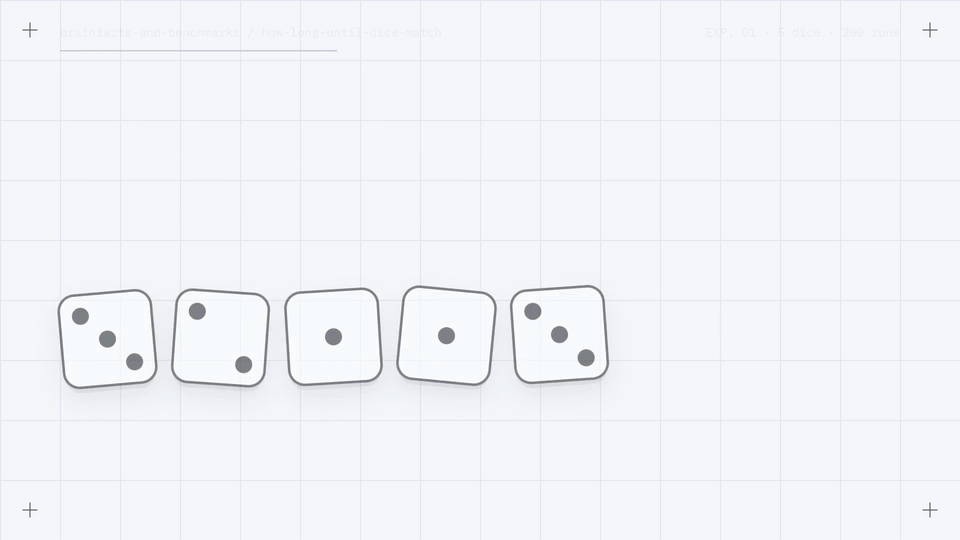

<div align="center">

# brainfarts-and-benchmarks 🧠⚡

**Small, curiosity-driven coding experiments — one question per folder, answered by measuring instead of guessing.**

[](https://www.python.org/downloads/)
[](https://docs.pytest.org/)
[](LICENSE)

[](brag-output/brag.mp4?raw=true)

<sub>▶️ Click the GIF for the full video with sound — <a href="brag-output/brag.mp4?raw=true"><code>brag-output/brag.mp4</code></a> (23 s · 3.7 MB)</sub>

[Experiments](#experiments) · [Quick start](#quick-start) · [Repository layout](#repository-layout) · [Adding an experiment](#adding-an-experiment) · [About the video](#about-the-video)

</div>

---

## Overview

Every experiment here starts as a small, sometimes stupid question — _why is this faster?_, _does this actually work?_, _how long would that take?_ — and ends as runnable code plus a write-up of what was tested and what was learned. Instead of letting those questions disappear, they live here.

Expect Python micro-benchmarks, probability brainfarts, and one-off notebooks. Languages may vary; curiosity is the only requirement.

**Ground rules**

- **One question per folder.** Experiments are self-contained — no shared code between them.
- **Measure, don't assume.** Claims come from runs, logs, and tests, not intuition.
- **Show the work.** Every experiment ships an `explained.md` with the method, the numbers, and the takeaway.
- **Assert correctness, report speed.** Benchmarks never fail a test for being slow — timings depend on the machine.

## Experiments

| Experiment | The question | What the data says |
| --- | --- | --- |
| **[How long until dice match?](how-long-until-dice-match/explained.md)**<br><sub>`how-long-until-dice-match/`</sub> | Roll _n_ fair dice until they all show the same face. How many rolls does that take? | Theory says 6ⁿ⁻¹ on average — **1,296** for five dice. A 200-simulation run (257,518 logged rolls) averaged **1,287.6**, yet single runs ranged from **2 to 8,738**. Expected value ≠ typical experience. |
| **[Why is `list * 2` faster?](why_is_list_multiply_faster/explained.md)**<br><sub>`why_is_list_multiply_faster/`</sub> | `nums * 2` and `nums + nums` build the same list. Do they cost the same? | Same O(n), different constants: `* 2` knows the final size and allocates once, taking **~26% less time per call** at n = 100. On tiny lists, call overhead dominates and `+` can win. Checked across 101 input sizes (220 tests). |

## Quick start

Developed on Python 3.14. Each experiment needs only a couple of packages; this installs everything:

```bash
git clone https://github.com/shreyuu/brainfarts-and-benchmarks.git
cd brainfarts-and-benchmarks
python3 -m venv .venv && source .venv/bin/activate
pip install tqdm pandas seaborn matplotlib pytest ipykernel
```

### Dice simulation

```bash
cd how-long-until-dice-match
python main.py   # prompts for the number of dice and the number of simulations
```

Every roll of every simulation is written to `logs/<dice>die_<sims>sim_<dd-mm-yy_HH-MM-SS>.txt` (new logs are git-ignored). To chart a run, open `charts.ipynb` in VS Code or JupyterLab (`pip install jupyterlab`), set `log_path` to your log file, and run all cells.

> [!TIP]
> Start small. Five dice average about 1,300 rolls per simulation; ten dice average about 10 million.

### List benchmark

From the repository root:

```bash
pytest -q -s                                      # 220 correctness tests + timing summary
python why_is_list_multiply_faster/experiment.py  # timeit on a 100,000-element list
```

The test run prints the average time per call for each visible input size, for example:

```text
n    plus_us     mul_us   winner
--------------------------------------
0        0.040     0.050   plus
10       0.086     0.082   mul
100      0.409     0.304   mul
```

Exact numbers vary by machine and Python version — which is why they're reported, never asserted.

## Repository layout

```text
brainfarts-and-benchmarks/
├── how-long-until-dice-match/       # Experiment: rolls until n dice all match
│   ├── main.py                      #   simulation that logs every roll of every run
│   ├── charts.ipynb                 #   parses a log → distribution, volatility, outlier plots
│   ├── logs/                        #   one log file per run
│   └── explained.md                 #   question, method, probability math, takeaways
├── why_is_list_multiply_faster/     # Experiment: nums * 2 vs nums + nums
│   ├── experiment.py                #   both implementations + a timeit harness
│   ├── tests/test_main.py           #   220 correctness tests + timing summary table
│   └── explained.md                 #   method, results, CPython internals
├── brag-output/                     # The video above: plan, HyperFrames composition, renders
├── main.py                          # Scratchpad: NetworkX drawing and layout-timing sketches
├── pytest.ini                       # pytest discovers tests from the repository root
└── LICENSE
```

## Adding an experiment

1. **Create a folder named after the question**, e.g. `is-dict-lookup-faster-than-list-scan/`. Use `snake_case` if pytest needs to import it as a package — that's why `why_is_list_multiply_faster/` has an `__init__.py`.
2. **Keep the code self-contained** in `main.py`, `experiment.py`, or a notebook — no imports from other experiments.
3. **Write `explained.md`** in the shape the existing write-ups use: the question → what was tested → results and why → time and space complexity → what it is _not_ → how to run → takeaway.
4. **For benchmarks, assert correctness and report timings.** Repeat each measurement and average it rather than timing a single call.
5. **Add a row to the [Experiments](#experiments) table.**

## Philosophy

This is a playground, not a library. It isn't production code, a framework, a tutorial series, or a best-practices guide — it's a place to ask small questions in public and keep the answers, because that's how you learn faster, remember _why_ things work, and stop being afraid of "wrong" code.

Some ideas are useful. Some are questionable. Some exist purely because curiosity won.

> If something here looks dumb — that’s probably the point.

## About the video

The GIF at the top is a 23-second launch-style video generated from this repository's own artifacts — the dice logs, the notebook's _Iterations per Simulation_ chart, and the pytest summary — using [HyperFrames](https://hyperframes.heygen.com). Every number on screen comes from the experiments. The plan, composition, and renders live in [`brag-output/`](brag-output/).

<details>
<summary>Rebuild the video and the GIF</summary>

Requires Node.js 22+ and FFmpeg.

```bash
cd brag-output/composition
npx hyperframes render --quality delivery --output ../brag.mp4
cd ..
# -ss 0.0334 skips frame 0, where the poster image is baked in
ffmpeg -ss 0.0334 -i brag.mp4 \
  -filter_complex "fps=12,scale=960:-1:flags=lanczos,split[a][b];[a]palettegen=stats_mode=diff[p];[b][p]paletteuse=dither=bayer:bayer_scale=5:diff_mode=rectangle" \
  -loop 0 brag.gif
```

GitHub's file viewer won't play the MP4 inline, so the GIF links to the raw file instead.

</details>

## License

[MIT](LICENSE) © 2026 Shreyash Meshram

---

<p align="center"><sub>If future-me is reading this: yes, some of this is ridiculous. Yes, it was worth writing down.</sub></p>
